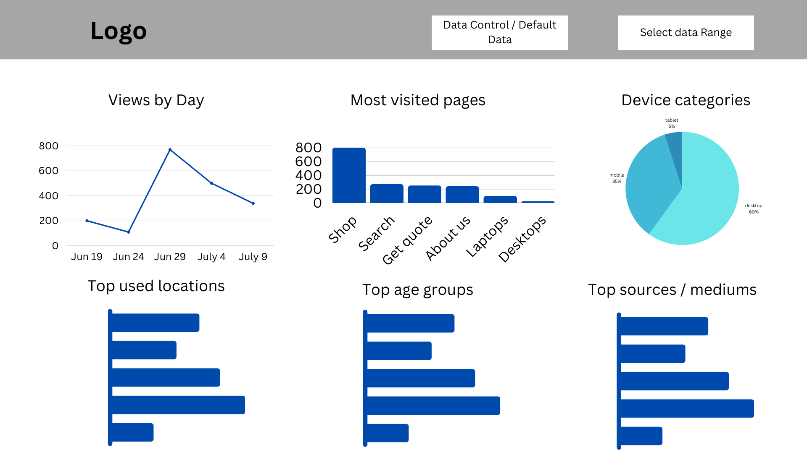
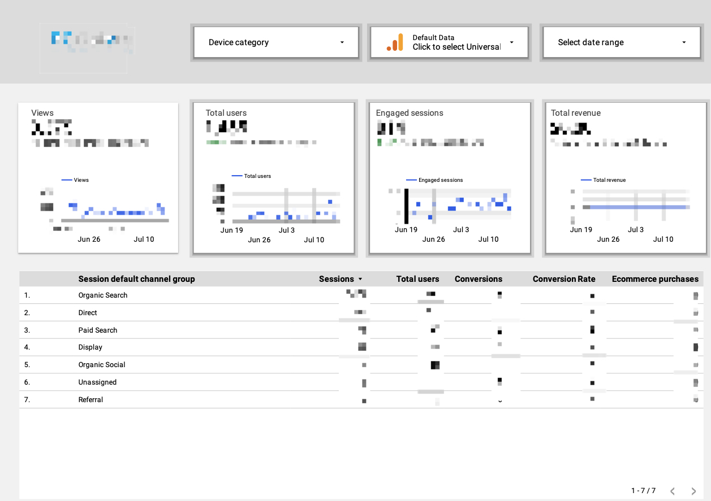
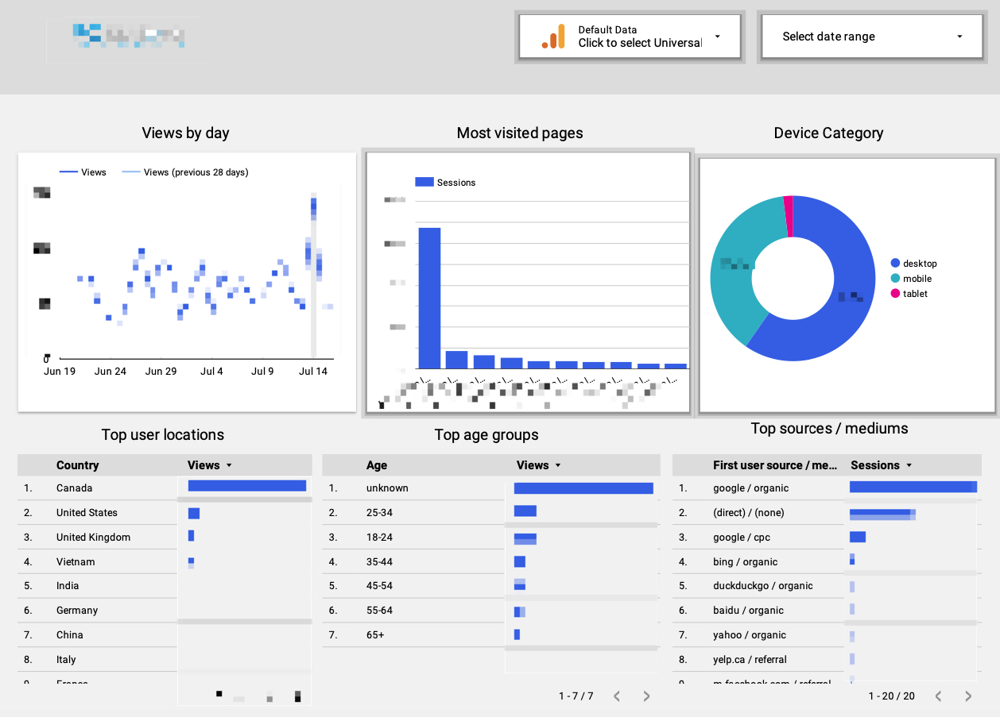

# E-commerce Website Analytics Dashboard with Google Looker Studio and Google Analytics 4

## Project Overview 
The dashboard below is designed using canva.com and implemented in Google Looker Studio (previously called "Google Data Studio") using data from Google Analytics 4.

## Data Source 
The e-commerce website is for a used computer and electronic store local to Vancouver. It has been a successful business but would like some online exposure. The data used in this data visualization project is from Google Analytics 4. I tagged the e-commerce website using Google Tag Manager and tracked website data for 2 months.

## Proposal 
While Google Analytics 4 offers dashboard customization features, I chose to import the Google Analytics 4 data into Google Looker Studio to build the dashboard for the following reasons: 
- Google Looker Studio allows for more extensive customization options, enabling the creation of more complex and visually appealing dashboards.
- Google Looker Studio offers advanced analytics features, including modeling, calculations, and data exploration, providing deeper insights into the data.
However, an advantage of using the Google Analytics 4 dashboard is that it provides real-time data, whereas Looker Studio processes data in batches. It's important to note that real-time data might be beneficial for websites with highly frequent and time-sensitive activities. However, since the website's activities don't occur very frequently and the focus is on long-term business strategies, real-time data doesn't seem to be extremely necessary for this specific scenario.
### Proposed metrics and graphs 
#### Dashboard 1: 
##### Business questions:
1. What are the volume of traffic on the website? 
2. Do users find the content of the website engaging? Is it easy to engage with the website?
3. How the sales are performing? 
4. How do customers / users find the website? 
5. What are some most visited pages on the website?
6. 
##### Metrics: 
- **Views**: In GA4, "views" refer to the total number of times a specific page or screen has been viewed. We would like to track the number of views of the website for the chosen time period and compare it to the same time in the previous period. To achieve this, we need a line graph and the percentage change number, which can be enabled in Google Looker Studio.
- **Total users**: This metric represents the total number of unique users who have initiated at least one session on the website. We want to know how this number changes overtime in the chosen time period and how it compares to the last time period, so we need a line graph to show the changes over time as well as a percentage change comparing to the previous period (which is a feature we can turn on in Google Looker Studio). 
- **Engaged sessions**: In GA4, this metric represents the number of sessions during which users actively engaged with the website. Meaningful engagements or actions include clicks, scrolls, and form submissions. A high number of engaged sessions is generally a positive sign of user satisfaction and interest. On the other hand, a low number of engaged sessions indicates that users do not find the content engaging. We would like to track this metric to evaluate how interesting the content on the website is.
Since the products on the website are updated on a daily basis, we are keen on understanding how user engagement changes over time and how it compares to the previous periods to gauge the attractiveness of the products. Therefore, I have designed a line graph to visualize these changes and included a percentage change comparison feature to assess how the current engagement level compares to the same time in the previous period.
- **Total revenue**: This metric represents the total sales within the chosen period of time. We want to know how this number changes over time and how this is comparing to the previous period   
- **Session default channel groups**: In GA4, these are predefined categories that classify the sources or channels from which traffic to the originates. These default channel groups are automatically assigned to sessions based on the source and medium of the traffic. We would like to know how users usually find the website and assess whether the Google Ads the company has implemented drive a substantial amount of traffic. 
- **Interactivity**:
  - Device category: We want to see the difference in the above-mentioned metrics when traffic comes from desktop (traditional computers and laptops), tablets, or mobile devices. I have designed dropdown options to allow us to view the metrics based on the different devices users use.
  - Data control: In GA4, default data refers to the automatically collected events and parameters that are sent by the Google Analytics measurement code (gtag.js) without the need for any additional configuration. We'd like to see the data source for the dashboards. 
  - Select date range: We would like to examine the data within custom time ranges for specific analyses. Therefore, I have implemented an option to select a customized date range."
  
#### Dashboard 2: 
##### Graphs:  
- Views by day line chart:  
- Most visited pages bar chart:  
- Device category pie chart: We want to know what device the users use to access the website, desktop (traditional computers and laptops), tablet or mobile. 
- Top user locations bar chart: 
- Top age groups bar chart:  
- Top sources / mediums bar chart: 
- Interactivity 
  - Default data 
  - Select date range 

#### Proposed Dashboard Sketches

 

### Final Dashboards 
**Note:** The final dashboards contain sensitive internal data, so I have covered the actual numbers and metrics, and will only show the structure of the dashboards. 

 

### Insights and Findings 

### Actionable Items  
